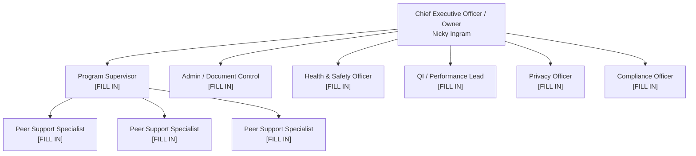

# Prayers of Care Inc | CARF Community Integration (BH) Binder
# Organizational Chart and Function Assignment

| | |
|---|---|
| **Document ID** | ORG-01 |
| **Version** | Draft 1 |
| **Status** | Draft → Approved → Trained → In use → Tested → Monitoring *(circle the current state)* |
| **Owner** | Nicky Ingram, Chief Executive Officer / Owner |
| **Approval date** | ____________ |
| **Effective date** | ____________ |
| **Chart date** | ____________ |
| **Review interval** | Annually, and within 14 days of any role change |
| **Next review due** | ____________ |
| **CARF areas served** | 1.A Leadership (p.31); 1.I Workforce Development and Management (p.80); 2.A Program/Service Structure (p.116) |
| **Legal entity** | Prayers of Care Inc |
| **NPI** | 1043895022 |
| **Consultant** | Successful Solutions (Tom Garner) — consultant only; not an officer or employee of Prayers of Care Inc |

> **Do not date this chart until the names are real.** A chart dated before it was filled in is
> a chart nobody used.

**Confirmed:** sole owner, no board of directors · owner plus 4–10 staff · already serving people.

---

## Purpose

Show who reports to whom, and — the part a surveyor actually checks — show that **every
required function is assigned to a named person**. A function nobody owns is a function nobody
does.

---

## 1. Function assignment — the table a surveyor reads first

The chart below shows reporting lines. This table shows accountability. In a small agency one
person holds several of these, which is normal and expected. What is **not** acceptable is a
function with nobody's name against it.

| # | Function | CARF area | Who holds it | Also their other role? | Backup if unavailable |
|---|---|---|---|---|---|
| 1 | Chief Executive Officer / Owner | 1.A | Nicky Ingram | — | `[FILL IN]` |
| 2 | Program Director / Program Supervisor | 1.A, 2.A | `[FILL IN]` | | `[FILL IN]` |
| 3 | Supervisor of the peer workforce | 1.I | `[FILL IN]` | | `[FILL IN]` |
| 4 | Quality Improvement lead | 1.L, 1.M | `[FILL IN]` | | `[FILL IN]` |
| 5 | Health and Safety Officer | 1.H | `[FILL IN]` | | `[FILL IN]` |
| 6 | **Privacy Officer** | 1.J, 2.G | `[FILL IN]` | | `[FILL IN]` |
| 7 | **Compliance Officer** | 1.A, 1.E | `[FILL IN]` | | `[FILL IN]` |
| 8 | Document Coordinator | 1.A | `[FILL IN]` | | `[FILL IN]` |
| 9 | Records custodian | 2.G | `[FILL IN]` | | `[FILL IN]` |
| 10 | Billing / claims | 1.F | `[FILL IN]` | | `[FILL IN]` |
| 11 | Accessibility / accommodation requests | 1.K | `[FILL IN]` | | `[FILL IN]` |

**Rows 6 and 7 were not on the original chart.** A Privacy Officer and a Compliance Officer are
both named roles a surveyor asks for by name — "who is your Privacy Officer?" is a question with
one correct form of answer, and it is a person's name. Add them even if they are you.

---

## 2. Text org chart

```
Chief Executive Officer / Owner
Nicky Ingram
Email: [FILL IN] | Phone: [FILL IN]
Supervised by: nobody — CEO and sole owner. See section 5.
|
+-- Program Supervisor: [FILL IN NAME]
|     Credential: [FILL IN]
|     |
|     +-- Peer Support Specialist: [FILL IN NAME]  Credential: [FILL IN]
|     +-- Peer Support Specialist: [FILL IN NAME]  Credential: [FILL IN]
|     +-- Peer Support Specialist: [FILL IN NAME]  Credential: [FILL IN]
|     +-- Peer Support Specialist: [FILL IN NAME]  Credential: [FILL IN]
|     +-- [add a line per person — the agency has 4-10 staff]
|
+-- Admin / Document Control: [FILL IN]
+-- Health & Safety Lead: [FILL IN]
+-- QI / Performance Lead: [FILL IN]
+-- Privacy Officer: [FILL IN]
+-- Compliance Officer: [FILL IN]
```

**Governance:** Owner-operated. **No board of directors at this time.** The Owner performs the
governance functions personally and records them. CARF titles area 1.B "Governance (Optional)"
in the 2026 manual — confirm with your CARF resource specialist whether you are electing it.

---

## 3. Diagram version

*Note: the original template used `\n` inside the node labels. Current Mermaid renders a line
break with `<br/>`, not `\n` — with `\n` the labels come out as one run-on line. Fixed below.*



---

## 4. Dual roles

One person holding several titles is normal in a small agency and CARF does not object to it.
What CARF asks is that it be **written down and honest**.

1. Write **both titles** on the chart, in the function table, and in the person's job
   description. A title that exists only in someone's head is not assigned.
2. Where a role is temporary, say so and say until when:
   `Nicky Ingram — CEO/Owner + acting QI Lead until a QI lead is designated`.
3. Where one person holds a role that is supposed to check another role they also hold, that is
   a **separation-of-duties issue**, not just a dual role. See section 5.

---

## 5. Who checks the Owner's work

This section exists because a sole-owner agency has a real, answerable problem, and a surveyor
will find it in about four minutes.

If the Owner delivers or oversees the service, **and** signs the cheques, **and** reviews the
records, **and** investigates complaints about the agency, then nobody independent is checking
anything. CARF does not require a board. It does expect the agency to have thought about this
and to have an answer.

Workable answers for an agency this size — pick and record at least one:

| Control | How it works here |
|---|---|
| Bank reconciliation by someone who does not write cheques | `[FILL IN — who]` |
| Record review by someone who did not write the documentation | `[FILL IN — likely the Program Supervisor]` |
| Grievances about the Owner routed to someone else | `[FILL IN — who, and how people are told]` |
| External accountant, bookkeeper or annual financial review | `[FILL IN — firm]` |
| External consultant reviewing quality findings | Successful Solutions |
| Persons served able to complain outside the agency | State licensing authority, the health plan, protection and advocacy, and CARF — all listed on the Rights handout |

**The compensating control chosen is recorded here and repeated in the financial controls
policy.** Writing "sole owner, no separation possible" and stopping is the answer that fails.

---

## 6. Coverage when someone is unavailable

From the succession requirement in 1.A. Fill the backup column in section 1, then confirm:

- Every function in section 1 has a named backup: `[ ] confirmed`
- At least two people can reach the record system, the bank, the payer portals, the building and the alarm: `[ ] confirmed`
- Where the Owner is the only person who can do something, that is written down as a known risk and carried on the risk register: `[ ] confirmed`

---

## 7. Procedure

1. Fill every name in section 1 and section 2. **Leave nothing as `[FILL IN]`** — an unassigned
   function is a finding.
2. Fill the backup column.
3. Record the compensating controls in section 5.
4. Date the chart on the day it is finished. Not before.
5. Share it with every staff member and record that below.
6. Post it where staff can see it.
7. **Update within 14 days of any role change**, re-date it, re-issue it, and log the change
   below. Remove the superseded chart from circulation the same day.
8. Review at least annually even if nothing changed, and record that.

---

## 8. Distribution record

| Name | Role | Chart version received | Date received | Signature |
|---|---|---|---|---|
| | | | | |
| | | | | |
| | | | | |

---

## 9. Change log

| Date of change | What changed | New version | Re-issued to staff (date) | Superseded copy removed |
|---|---|---|---|---|
| | | | | |
| | | | | |

---

## 10. What a surveyor will ask

| They ask | They are testing | What has to be true |
|---|---|---|
| "Who is your Privacy Officer?" | 1.J — named accountability | A name comes back immediately, from anyone |
| "Who is accountable for quality?" | 1.A | A name, not "we all are" |
| "Who supervises the peer specialists?" | 1.I | A name, and that person's credential |
| "Who reviews the records? Did they write any of them?" | 2.H independence | The reviewer did not write what they reviewed |
| "If a person served had a complaint about the Owner, who would hear it?" | 1.J, 1.A | A route that does not run through the Owner |
| "Is this chart current?" | 1.A | The chart date matches the actual staffing today |
| Asked of a **peer specialist**: "who do you report to?" | Whether the chart is real | Their answer matches the chart |

---

*Prayers of Care — CARF Community Integration binder — ORG-01 — prepared with Successful Solutions*
